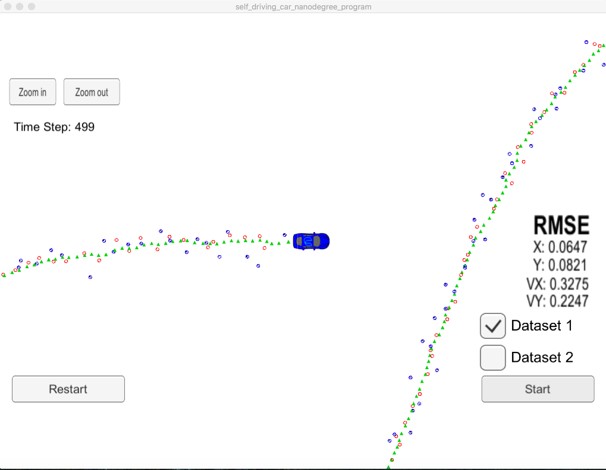
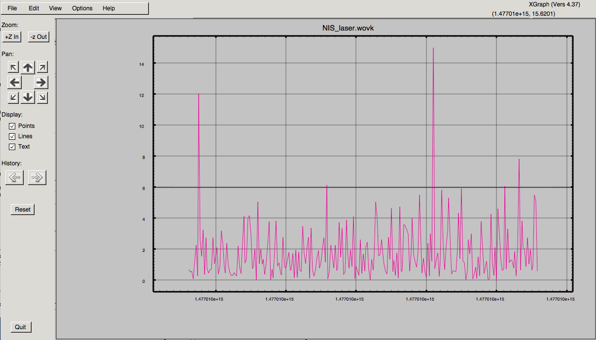
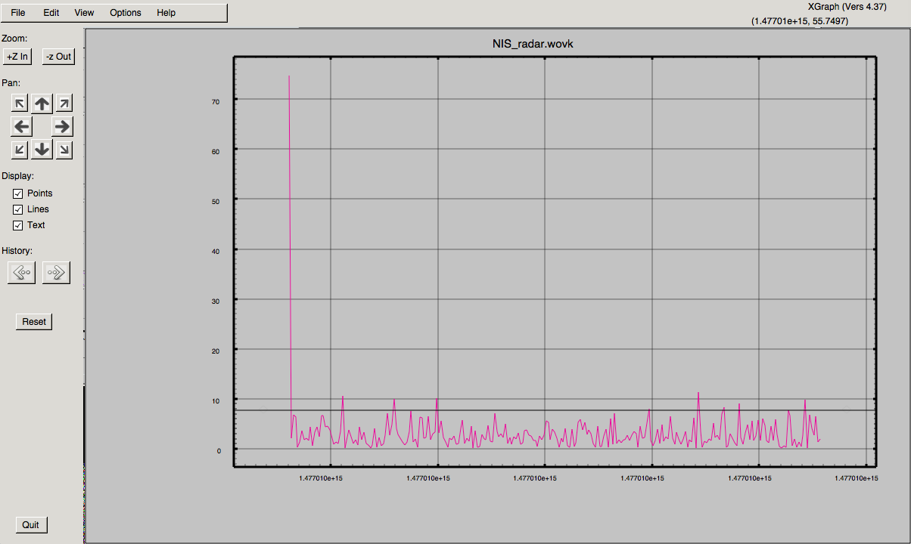
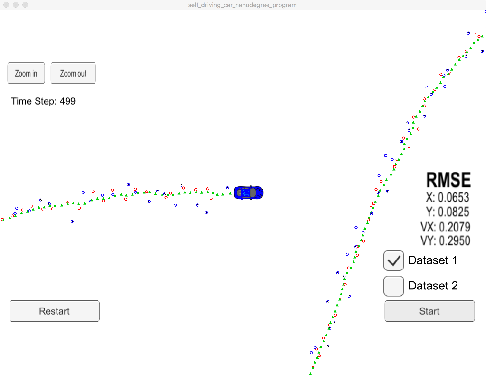
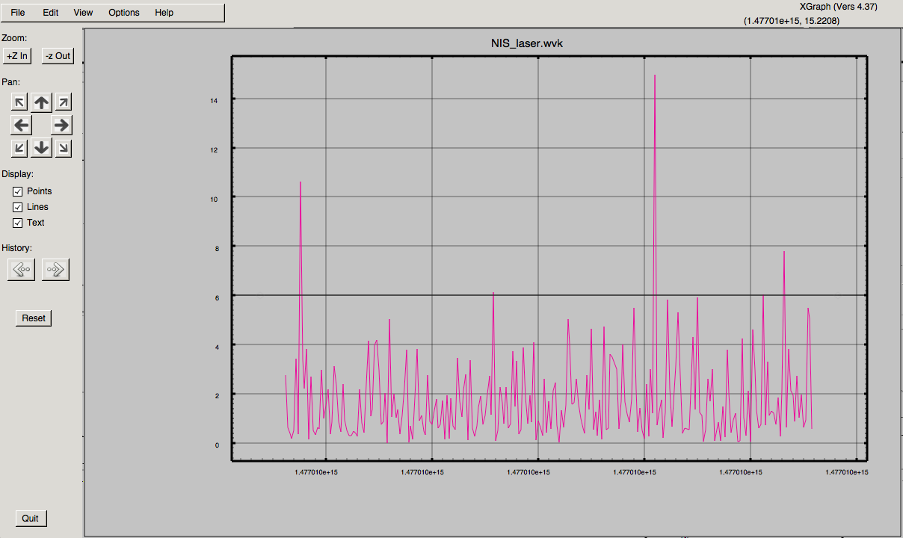
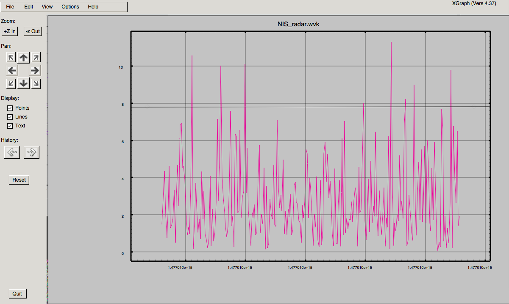

# Self-Driving Car Engineer Nanodegree Program
# *CarND-Unscented-Kalman-Filter*

## Introduction
In this project utilize an Unscented Kalman Filter to estimate the state of a moving object of interest with noisy lidar and radar measurements in C++. A simulator provided by Udacity (it could be downloaded [here](https://github.com/udacity/self-driving-car-sim/releases)) generates noisy RADAR and LIDAR measurements of the position and velocity of an object, and the Unscented Kalman Filter [UKF] must fusion those measurements to predict the position of the object. 

The project includes the following directories:
* **Src**:
This directory includes all the C++ files acting as Unscented Kalman Filters.
Most of the files are taken as given except `ukf.cpp`, `ukf.h`, `tools.cpp` and `main.cpp`. They have been extended to include all the necessary routines and operations for Unscented Kalman Filtering and to fulfill bonus tasks.
* **Images**:
In this directory, data graph pictures of NIS are collected.
* **Datafiles**:
The most important generated NIS datafiles and overall datafile can be found here.

## Unscented Kalman Filter Implementation
Most of the code has been copied over from the developed code of the lecture about Unscented Kalman Filters. They have been extended by calculating the update by laser measurement, their initialization, the output of the NIS data for radar and laser measurement and the output of the overall data for visualization.
The update of the laser measurement is implemented by the `UKF::UpdateLidar` function in the `ukf.cpp` file. The initialization of the status `x_` and covariance `P_` with first laser data is integrated into the `UKF::ProcessMeasurement` function (l.117-119). Initialization values for the covariance positions were taken from the standard deviation `std_laspx_` and `std_laspy_` (similar for radar).
For NIS data output, the constructor and destructor of UKF class are implemented with file opening and closing functions respectively. The file handler are defined in the header file. The data is written out during the update functions of laser or radar measurement.
The output of the overall data for visualization is implemented into the `main.cpp`.
 
## Unscented Kalman Filter Simulation
Choosing the following values:
 * std_a_: 	1.0
 * std_yawdd: 	0.25 * M_PI
 * vk init value:	0.0

The following simulation results are reached:

With the following NIS data:

  

 
The NIS data of radar (graph on the right) show a tremendous discrepancy at the beginning. The reason is an inappropriate selection of value 0.0 for the velocity `vk` during initialization. As we have information about the observed object (bicycle), we can choose an appropriate value for `vk`. (This could be overtaken by optical classification in a more real scenario).

 
To avoid the large discrepancy at the beginning, the following values are finally chosen: 
 * std_a_: 	1.0
 * std_yawdd: 	0.25 * M_PI
 * vk init value:	4.0

The final simulation results are:

With the following NIS data:

  

 
## Comparison of ground truth values with Unscented Kalman Filter values:
 
Out of the graph, one can see that the position calculations `est(x)` and `est(y)` of the Unscented Kalman Filter (dotted lines) follow very well the lines of the ground truth (solid lines).
The calculated values of the velocity (`est(vx)` and `est(vy)`) have a lot of outliers to the ground truth lines, especially at the beginning. 

---

# **Original Udacity README**

In this project utilize an Unscented Kalman Filter to estimate the state of a moving object of interest with noisy lidar and radar measurements. Passing the project requires obtaining RMSE values that are lower that the tolerance outlined in the project rubric. 

This project involves the Term 2 Simulator which can be downloaded [here](https://github.com/udacity/self-driving-car-sim/releases)

This repository includes two files that can be used to set up and intall [uWebSocketIO](https://github.com/uWebSockets/uWebSockets) for either Linux or Mac systems. For windows you can use either Docker, VMware, or even [Windows 10 Bash on Ubuntu](https://www.howtogeek.com/249966/how-to-install-and-use-the-linux-bash-shell-on-windows-10/) to install uWebSocketIO. Please see [this concept in the classroom](https://classroom.udacity.com/nanodegrees/nd013/parts/40f38239-66b6-46ec-ae68-03afd8a601c8/modules/0949fca6-b379-42af-a919-ee50aa304e6a/lessons/f758c44c-5e40-4e01-93b5-1a82aa4e044f/concepts/16cf4a78-4fc7-49e1-8621-3450ca938b77) for the required version and installation scripts.

Once the install for uWebSocketIO is complete, the main program can be built and ran by doing the following from the project top directory.

1. mkdir build
2. cd build
3. cmake ..
4. make
5. ./UnscentedKF

Tips for setting up your environment can be found [here](https://classroom.udacity.com/nanodegrees/nd013/parts/40f38239-66b6-46ec-ae68-03afd8a601c8/modules/0949fca6-b379-42af-a919-ee50aa304e6a/lessons/f758c44c-5e40-4e01-93b5-1a82aa4e044f/concepts/23d376c7-0195-4276-bdf0-e02f1f3c665d)

Note that the programs that need to be written to accomplish the project are src/ukf.cpp, src/ukf.h, tools.cpp, and tools.h

The program main.cpp has already been filled out, but feel free to modify it.

Here is the main protcol that main.cpp uses for uWebSocketIO in communicating with the simulator.

INPUT: values provided by the simulator to the c++ program

["sensor_measurement"] => the measurment that the simulator observed (either lidar or radar)

OUTPUT: values provided by the c++ program to the simulator

["estimate_x"] <= kalman filter estimated position x
["estimate_y"] <= kalman filter estimated position y
["rmse_x"]
["rmse_y"]
["rmse_vx"]
["rmse_vy"]

---

## Other Important Dependencies
* cmake >= 3.5
  * All OSes: [click here for installation instructions](https://cmake.org/install/)
* make >= 4.1 (Linux, Mac), 3.81 (Windows)
  * Linux: make is installed by default on most Linux distros
  * Mac: [install Xcode command line tools to get make](https://developer.apple.com/xcode/features/)
  * Windows: [Click here for installation instructions](http://gnuwin32.sourceforge.net/packages/make.htm)
* gcc/g++ >= 5.4
  * Linux: gcc / g++ is installed by default on most Linux distros
  * Mac: same deal as make - [install Xcode command line tools](https://developer.apple.com/xcode/features/)
  * Windows: recommend using [MinGW](http://www.mingw.org/)

## Basic Build Instructions

1. Clone this repo.
2. Make a build directory: `mkdir build && cd build`
3. Compile: `cmake .. && make`
4. Run it: `./UnscentedKF` Previous versions use i/o from text files.  The current state uses i/o
from the simulator.

## Editor Settings

We've purposefully kept editor configuration files out of this repo in order to
keep it as simple and environment agnostic as possible. However, we recommend
using the following settings:

* indent using spaces
* set tab width to 2 spaces (keeps the matrices in source code aligned)

## Code Style

Please stick to [Google's C++ style guide](https://google.github.io/styleguide/cppguide.html) as much as possible.

## Generating Additional Data

This is optional!

If you'd like to generate your own radar and lidar data, see the
[utilities repo](https://github.com/udacity/CarND-Mercedes-SF-Utilities) for
Matlab scripts that can generate additional data.

## Project Instructions and Rubric

This information is only accessible by people who are already enrolled in Term 2
of CarND. If you are enrolled, see [the project page](https://classroom.udacity.com/nanodegrees/nd013/parts/40f38239-66b6-46ec-ae68-03afd8a601c8/modules/0949fca6-b379-42af-a919-ee50aa304e6a/lessons/c3eb3583-17b2-4d83-abf7-d852ae1b9fff/concepts/f437b8b0-f2d8-43b0-9662-72ac4e4029c1)
for instructions and the project rubric.

## How to write a README
A well written README file can enhance your project and portfolio.  Develop your abilities to create professional README files by completing [this free course](https://www.udacity.com/course/writing-readmes--ud777).

